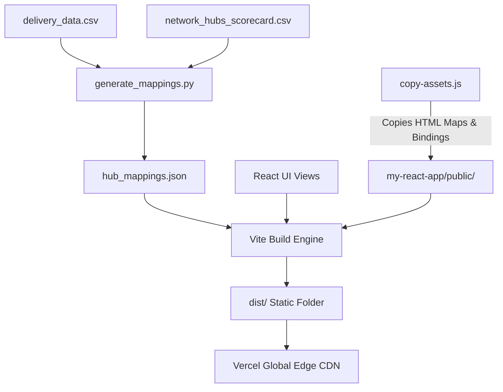

# Delhivery Route Intelligence: Graph-Based Logistics ETA Optimization

This repository houses the end-to-end consulting and data science solution for **Optimizing Delivery ETAs with Graph-Based Network Intelligence** at Delhivery, India's largest fully-integrated logistics provider. 

By modeling Delhivery's logistics network as a **directed weighted graph** (facilities as nodes, corridors as edges), this system overrides optimistic OSRM (Open Source Routing Machine) routing times with real-world logistics parameters—including facility dwell times, corridor delays, vehicle type dynamics, and peak-hour traffic coefficients.

---

## 📖 Table of Contents
1. [Business Context & Mission](#-business-context--mission)
2. [Repository Structure](#%EF%B8%8F-repository-structure)
3. [Architecture Overview](#-architecture-overview)
4. [Analytics & Centrality Metrics](#-analytics--centrality-metrics)
5. [Frontend Dashboard Tabs](#-frontend-dashboard-tabs)
6. [Getting Started (Local Execution)](#-getting-started-local-execution)
7. [Production Deployment (Vercel)](#-production-deployment-vercel)

---

## 💼 Business Context & Mission

Delhivery operates on a hub-and-spoke model where shipments travel through one or more intermediate hubs before reaching their destination. To estimate delivery times, traditional routing engines assume clean roads and shortest paths. 

In practice, congestion, sorting delays, route restrictions, and vehicle-type trade-offs (e.g., FTL vs. Carting loops) cause actual arrival times to deviate significantly from OSRM estimates. When predictions are wrong, delivery SLA targets are missed, capacity planning breaks down, and revenue is put at risk.

**Our Mission:**
1. **Model the logistics network** as a directed graph where edge weights capture median actual-vs-OSRM delays.
2. **Examine facility bottlenecks** using network centrality metrics (Betweenness, in/out degrees, and clustering coefficients).
3. **Train advanced machine learning models** to predict realistic ETAs using graph-derived features.
4. **Develop a vehicle selection advisor** to automate FTL vs. Carting loop decisions.
5. **Produce an operational dashboard** and consulting memo summarizing revenue-recovery strategies.

---

## 🛠️ Repository Structure

```directory
├── backend/
│   ├── .venv/                         # Python Virtual Environment
│   ├── delivery_data.csv              # Raw Segment and Trip historical records (55MB)
│   ├── network_hubs_scorecard.csv     # Centrality scorecard generated for 1,657 hubs
│   ├── graph_enhanced_ml_dataset.csv  # Merged features dataset used for ML training
│   ├── grapGeneration.py              # Visual PyVis network graph generator (standard names)
│   ├── displayGraph.py                # Visual PyVis network graph generator (centrality IDs)
│   ├── generate_mappings.py           # Pre-processes data, merging scorecard IDs with friendly names
│   ├── ETA_model_training.py          # Random Forest Regressor training for travel time predictions
│   ├── transport_model.py             # Random Forest Classifier training for FTL vs. Carting loops
│   └── lib/                           # Web assets for PyVis bindings
├── frontend/
│   ├── delhivery_network_map.html             # PyVis compiled map (Location Names)
│   ├── delhivery_interactive_network_IDS.html # PyVis compiled map (Centrality IDs)
│   └── my-react-app/
│       ├── copy-assets.js             # Asset copier script executing pre-build/pre-dev
│       ├── package.json               # Frontend build and dependency config
│       ├── vercel.json                # Vercel deployment routes and SPA rewrite settings
│       ├── public/                    # Assets served statically (Vite bundle inputs)
│       └── src/
│           ├── App.tsx                # Dashboard routing state manager (auth bypassed)
│           ├── index.css              # Main layout variables (Full-screen viewport enabled)
│           ├── components/
│           │   ├── dashboard.tsx      # Main dashboard controller and tab panes
│           │   ├── dashboard.css      # Dark-theme dashboard styles and custom badges
│           │   └── navbar.tsx         # Responsive navigation menu (Logout mapped to Reset)
│           └── services/
│               ├── api.ts             # Static simulation fallbacks and FastAPI connectors
│               └── hub_mappings.json  # Complete pre-processed directory database (1,657 hubs)
├── vercel.json                        # Vercel root deployment router
├── package.json                       # Root script orchestrator for monorepo installs
└── README.md                          # Main project guide (this file)
```

---

## ⚙️ Architecture Overview

The system is designed as a modular **monorepo**:


* **Data Pipeline (Python)**: Parses segment logs, builds a NetworkX graph, computes centrality metrics, cleans node name labels, and outputs a compressed JSON map of the entire network.
* **Core Dashboard (React + TypeScript)**: Built on Vite using responsive CSS variables. Designed with a premium dark-mode theme, glassmorphism panel containers, and micro-interactions.
* **Fidelity Simulators (TypeScript)**: Since static hosting drops FastAPI connections, a client-side simulator mimics the trained Random Forest Regressor and Classifier pipelines, providing high-fidelity, real-time feedback when adjusting multipliers.

---

## 📈 Analytics & Centrality Metrics

To pinpoint chokepoints, the system evaluates:
* **Betweenness Centrality (Chokepoint Score)**: Measures how frequently a node lies on the shortest transit path between other nodes. Nodes with a score > 0.05 are flagged as **Critical Bottlenecks** representing key operational gates.
* **Degree Ratios**: Compares inflow lanes against outflow lanes to locate sorting gates where cargo backlogs build up.
* **Typical Warehouse Dwell Time**: Simulated based on chokepoint centrality to reflect sorting delays.

---

## 🖥️ Frontend Dashboard Tabs

The user interface spans a **full-screen viewport** and features the following tabs:

1. **Network Graph**: Displays interactive 3D Directed Graph Visualizations of Delhivery's lanes. Toggles between *Regional Hub Names* and *Centrality ID Mapping*.
2. **Network ID Mapping**: A searchable, filterable glossary directory of the **1,657 hubs** in the network. Translates facility IDs (e.g. `IND000000ACB`) to city names, regional states, and operational roles for non-technical stakeholders.
3. **Bottleneck Analysis**: Lists chokepoint hubs ranked by betweenness centrality with warning badges and direct deep-dive inspections.
4. **ETA Prediction**: Allows operators to enter trip parameters (Origin, Destination, Distances, Day of Week, Start Hour) to calculate real-world ETAs using the ML model.
5. **Corridor Intelligence**: Displays lanes experiencing chronical delay ratios (Actual-vs-OSRM time > 1.20x).
6. **FTL vs Carting**: Analyzes weight and SLA requirements using the classifier model to recommend Carting loops or FTL consolidation.
7. **Hub Details**: Displays inbound and outbound connectivity, active shipments, and station status logs for a selected hub.
8. **Alerts**: A real-time incident monitor logging severe dwellings and congestion flags.
9. **Reports**: Quantifies the monthly financial loss from congestion delays and maps saving opportunities.
10. **Admin Panel**: Adjusts peak traffic coefficients, dwell thresholds, and resets parameters to historical baselines.

---

## 🚀 Getting Started (Local Execution)

### Prerequisites
* **Python**: v3.10 or higher
* **Node.js**: v18.0.0 or higher
* **npm**: v9.0.0 or higher

### 1. Setup Backend & Pre-Process Data
Navigate to the backend directory, initialize a virtual environment, and install dependencies:
```bash
cd backend
python -m venv .venv
# Activate on Windows:
.venv\Scripts\activate
# Activate on Unix:
source .venv/bin/activate

pip install pandas networkx pyvis scikit-learn
```

To regenerate the scorecard, name mappings, and export the React database:
```bash
python generate_mappings.py
```

### 2. Setup and Start the Frontend
Navigate to the React application, install dependencies, and run the developer server:
```bash
cd ../frontend/my-react-app
npm install
npm run dev
```
The pre-development script will automatically copy the PyVis maps and library bindings from the parent directory into `public/`. Open `http://localhost:5173` in your browser.

---

## ☁️ Production Deployment (Vercel)

The repository is fully configured for zero-setup deployments on **Vercel**:

1. **Monorepo Settings**: Vercel reads the root `package.json` and automatically triggers a monorepo setup.
2. **Build Configuration**: Vercel triggers `npm install` and runs `npm run build` in the subdirectory.
3. **Asset Pipelines**: The asset copier copies `delhivery_network_map.html` and `delhivery_interactive_network_IDS.html` directly into the `dist/` directory.
4. **Rewrite & Clean URLs**: `vercel.json` intercepts routing calls. Rewrites ensure static HTML maps are served directly, while fallback queries redirect to `index.html` for single-page routing:

```json
{
  "cleanUrls": true,
  "outputDirectory": "frontend/my-react-app/dist",
  "rewrites": [
    { "source": "/(delhivery_network_map.html|delhivery_interactive_network_IDS.html|lib/bindings/utils.js)", "destination": "/$1" },
    { "source": "/(.*)", "destination": "/index.html" }
  ]
}
```

Simply connect this repository to your Vercel account, set the framework preset to **Vite**, and deploy!
